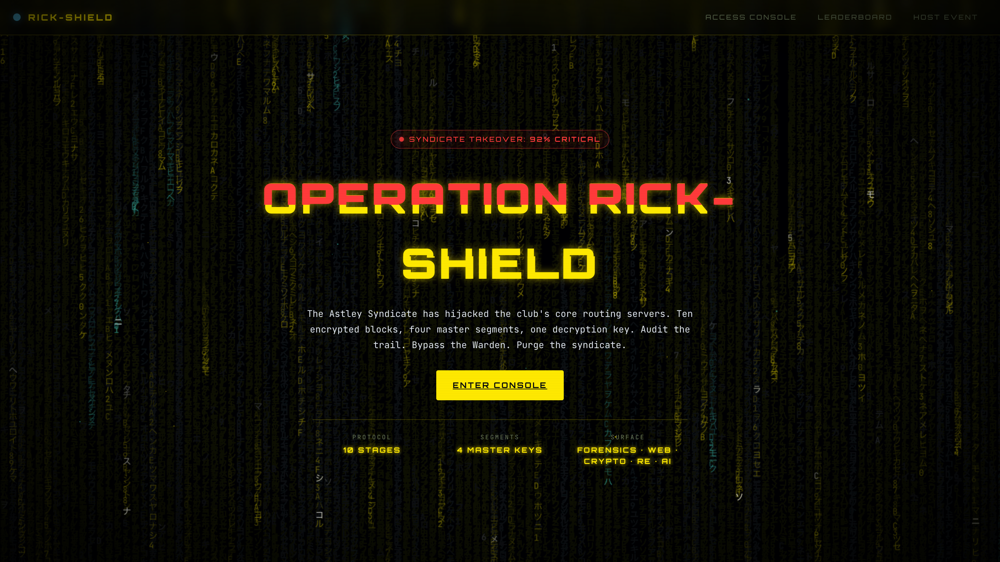
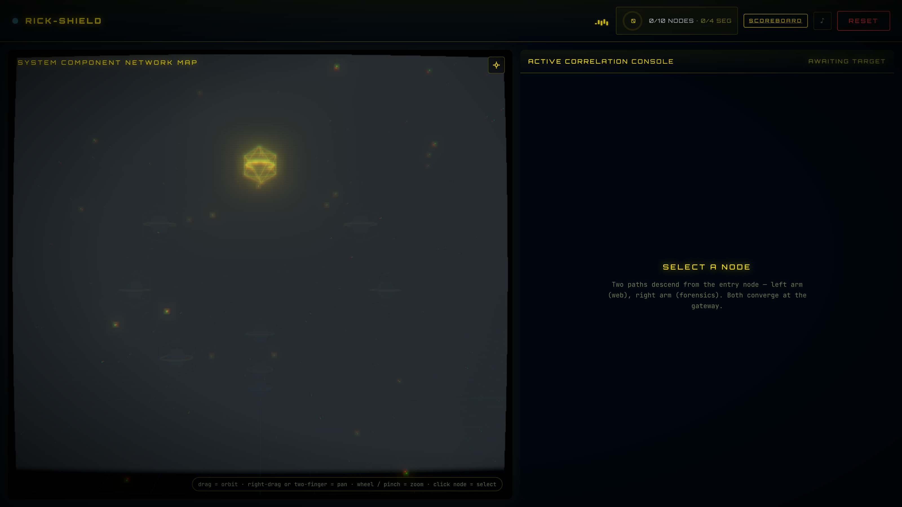
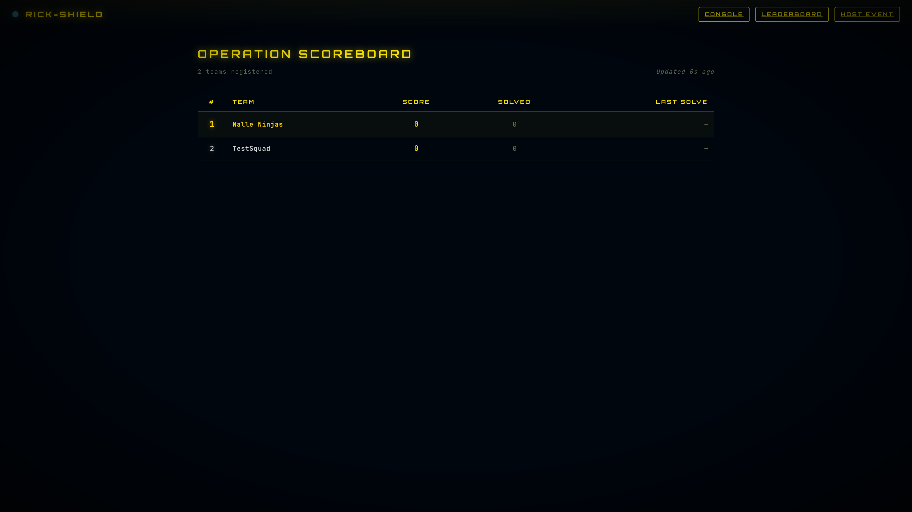

  

<h1 align="center">⚡ OPERATION RICK-SHIELD ⚡</h1>

<strong>A 10-stage cyber-heist CTF. Breach the nodes. Recover the master key. Purge the Syndicate.</strong>

  🔴 <strong>SYNDICATE TAKEOVER: 92% CRITICAL</strong> &nbsp;·&nbsp; the clock is running

  <a href="https://rickshield-ctf.vercel.app"><strong>▶ ENTER THE OPERATION</strong></a>

---

## The Briefing

The **Astley Syndicate** has hijacked the club's core routing servers and locked them behind ten encrypted blocks. Four of those blocks hide fragments of a **master decryption key**. Your job, operative: work the network node by node, recover every fragment, defeat the keeper at the final gate, and reassemble the key before the takeover completes.

This is a story-driven, single-player-or-team Capture-The-Flag built to make you *think* — no guesswork, no filler, every node a real puzzle.

## What you'll face

A deliberately broad gauntlet — you'll switch hats constantly:

- 🔍 **Forensics** — buried signals, wiped timelines, dead sectors, traffic ghosts
- 🌐 **Web exploitation** — injection, identity spoofing, forged credentials
- 🔐 **Crypto & side-channels** — timing leaks, padding oracles, rotating keys
- 🧩 **Reversing** — a custom machine you'll have to read instruction by instruction
- 🕵️ **OSINT & stego** — things hidden in plain sight, and in the bytes you overlook
- 🤖 **The Warden** — a final-node AI that lies to your face. Outsmart it.

…plus a hidden **ghost node** for those who read *everything*.

## Why it hits different

  

- **A living 3D network map** — every stage is a node; locked nodes light up as you clear their prerequisites.
- **Fog of war** — the deeper graph stays dark until you earn your way toward it.
- **Dynamic scoring** — the more teams crack a node, the less it's worth. First blood pays.
- **A breach you can feel** — a decrypt sequence on every solve, and the system *fights back* when you're wrong.
- **Built-in toolkit** — per-stage notes, command palette, focus mode, deep links.

## Climb the board

  

Live scoreboard with first-blood badges and team-vs-team tracking. Register a team, bring your crew, and race the rest of the field in real time.

## How to play

1. **[Open the console »](https://rickshield-ctf.vercel.app)**
2. Register a team (or dive in solo).
3. Start at the entry node and follow the trail.
4. Recover all four master segments → reassemble the key → purge the Syndicate.

No install. No setup. Just a browser and your wits.

  <a href="https://rickshield-ctf.vercel.app"><strong>▶ THINK YOU CAN PURGE THE SYNDICATE?</strong></a>

---

  This is the operation's public briefing. The platform and challenge content are private — the only way through is to <a href="https://rickshield-ctf.vercel.app">play</a>. Good hunting.

